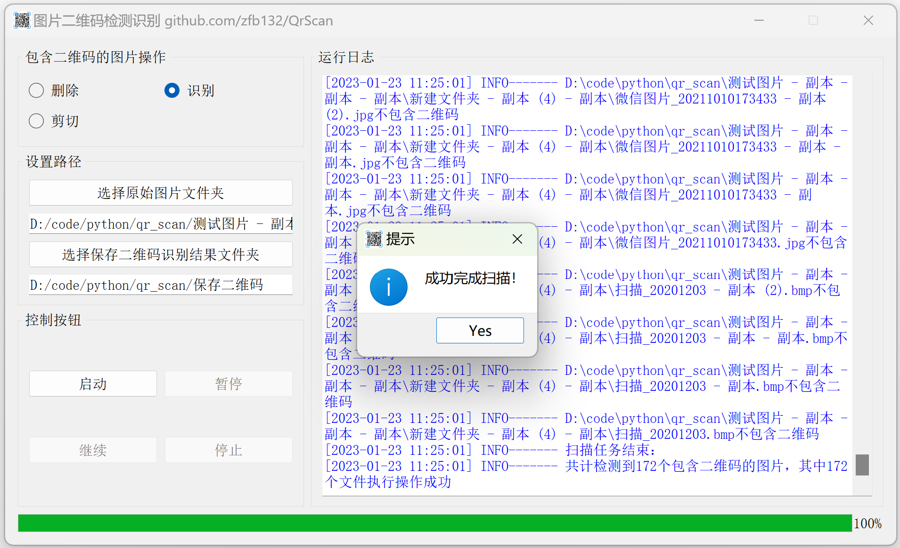

# QrScan
二维码图片批量检测软件  
支持常见的图片文件：`jpg`、`jpeg`、`png`、`bmp`、`tif`、`tiff`、`pbm`、`pgm`、`ppm`、`ras`等（识别二维码根据的是文件内容，即使扩展名为其他的，只要文件内容是图片编码都可识别）  

启动软件界面  
  
  
软件运行过程  
  

软件运行结束  
  

## 功能
* 完全离线的软件，升级和更新在GitHub查看
* 能够批量排查图片是否包含二维码
* 支持文件夹导入排查范围，自动遍历所有子文件夹
* 支持拖放文件夹到程序的输入框
* 支持选择对包含二维码图片进行的操作：删除、剪切
* 对于剪切操作，需要设置保存剪切文件的文件夹，遇到文件重名将会按时间戳重命名
* 支持实时日志显示与进度展示
* 支持多进程极速检测

## 免责声明
一切下载及使用本软件时均被视为已经仔细阅读并完全同意以下条款：  
* 软件仅供个人学习与交流使用，严禁用于非法用途，转载需申请作者授权
* 严禁未经书面许可用于商业用途
* 使用本软件所存在的风险将完全由其本人承担，软件作者不承担任何责任
* 软件注明之服务条款外，其它因不当使用软件而导致的任何意外、疏忽、合约毁坏、诽谤、版权或其他知识产权侵犯及其所造成的任何损失，软件作者不承担任何法律责任
* 本声明未涉及的问题请参见国家有关法律法规，当本声明与国家有关法律法规冲突时，以国家法律法规为准
* 本软件相关声明版权及其修改权、更新权和最终解释权均属软件作者所有